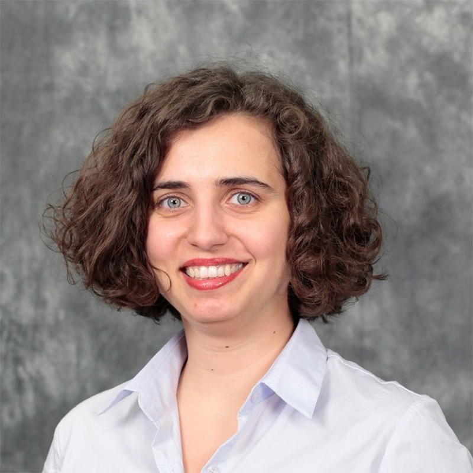
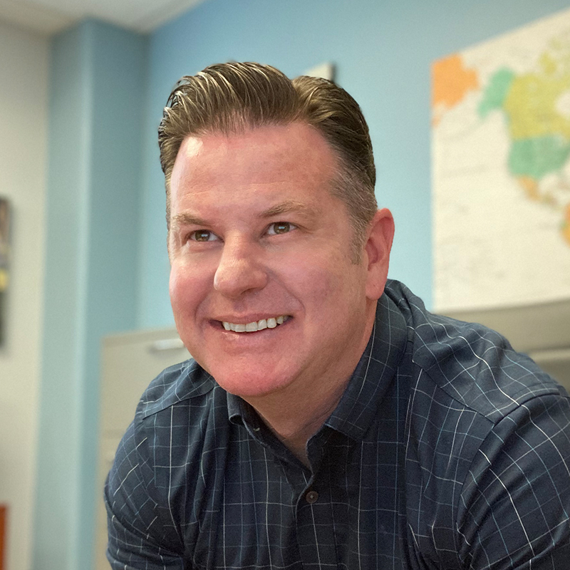
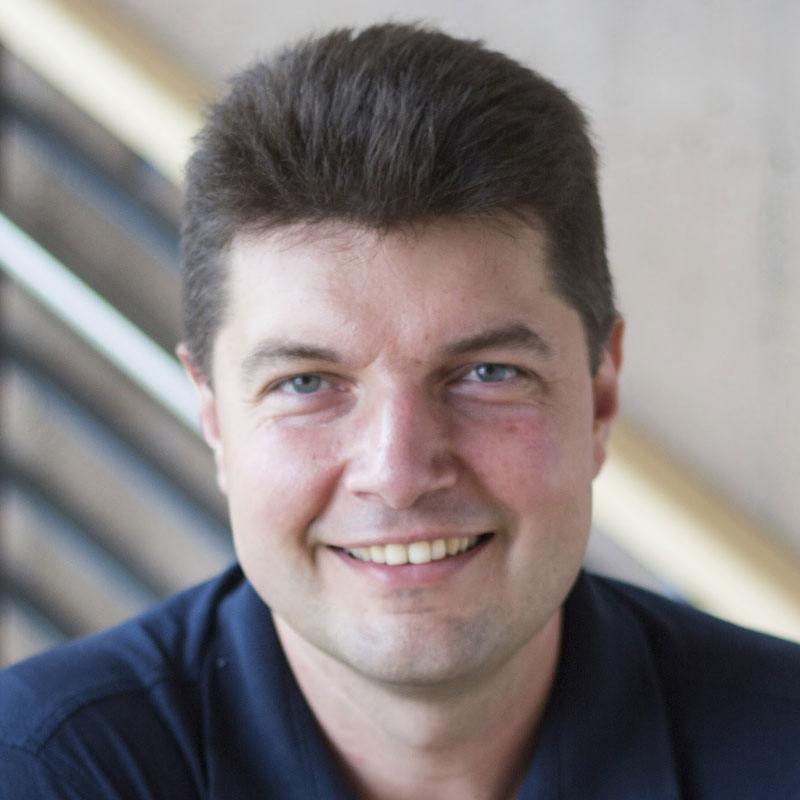
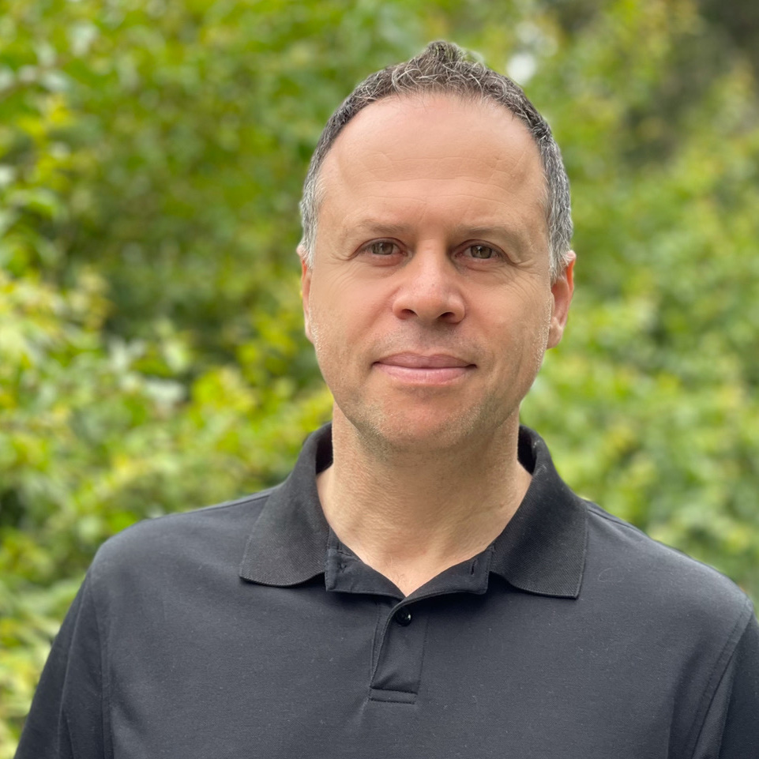

```{r setup, include=FALSE}
knitr::opts_chunk$set(echo = FALSE)

```

<!--The list of faculty and staff for ISI-BUDS 2022 can be found [here](faculty-staff-2022.html).--> The full list of faculty and staff for ISI-BUDS 2026 will be announced at a later date. 

<h2 id="faculty">Co-Directors</h2>
<table>
<tr>
<td></td>


<td></td>


<td></td>

<td></td>

</tr>

<tr class="odd">
<td>Dr. Mine Dogucu</td>
<td>Dr. Daniel Gillen</td>
<td>Dr. Volodymyr Minin</td>
<td>Dr. Babak Shahbaba</td>
</tr>

<tr class="header">


</tr>

</table>


<div class="sourceCode" id="cb1"><pre class="sourceCode r distill-force-highlighting-css"><code class="sourceCode r"></code></pre></div>
<!--radix_placeholder_article_footer-->
<!--/radix_placeholder_article_footer-->
</div>


