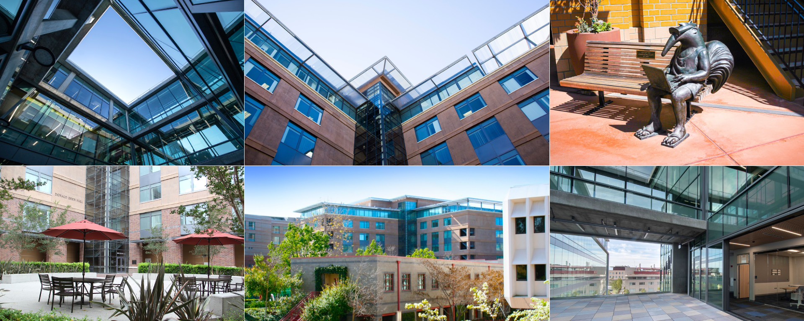

```{r setup, include=FALSE}
knitr::opts_chunk$set(echo = FALSE)

# Learn more about creating websites with Distill at:
# https://rstudio.github.io/distill/website.html

# Learn more about publishing to GitHub Pages at:
# https://rstudio.github.io/distill/publish_website.html#github-pages

```
{width="100%"}

ISI-BUDS is a six-week summer program introducing undergraduate students to modern methodology and practice of biostatistics and data science. The program will highlight applications in cutting
edge biomedical research, will train students in fundamentals of biostatistics, data science, and computing, and will culminate in a team project co-supervised by statisticians and biomedical scientists.

**Support**: there are no costs or fees associated with the program. Moreover, accepted participants will be provided with

- up to $500 to cover travel expenses
- free housing that includes a meal plan 
- $1000 stipend for incidental expenses


**Application**: check your eligibility and apply [here](apply.html). 
We strongly encourage applications from students from historically excluded groups.

**Funding**: ISI-BUDS is suppored by the National Institute Of Allergy And Infectious Diseases of the National Institutes of Health under Award Number R25AI170491, as one of the Summer Institutes in Biostatistics (SIBS) and Data Science. To learn about other SIBS visit [the program webpage](https://www.nhlbi.nih.gov/grants-and-training/summer-institute-biostatistics). 

## Important Dates

Applications due - March 24

Results announced (on a rolling basis) - starting April 14

ISI-BUDS dates - July 10 - Aug 18


